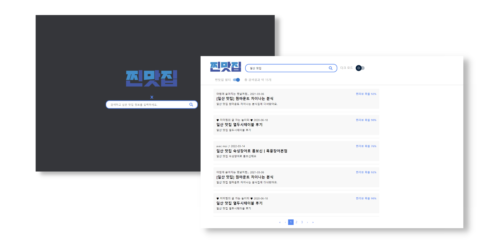

# 딥러닝 기반 맛집 광고 리뷰 필터링 서비스: 찐맛집
찐맛집은 BERT 기반 모델으로 네이버 맛집 리뷰 중 광고일 가능성이 높은 게시글을 필터링하는 서비스 입니다.
PyTorch를 이용하여 딥러닝 모델을 학습시키기 위한 저장소 입니다.

## Tech Stack

**Client:** React

**Server:** Java Spring Boot

**Classifier** Pytorch

**Classifier Server** Fast API

## Architecture

## Screenshots

